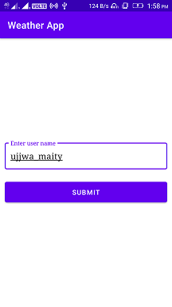
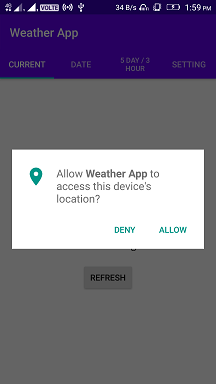
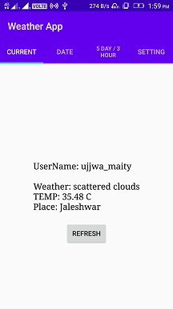
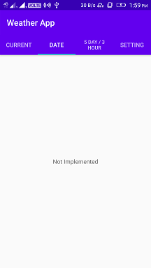
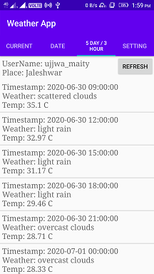
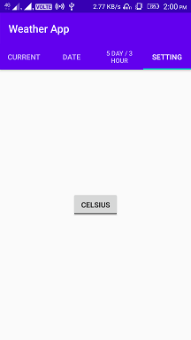

# Weather App

## Problem Statement

```
ATTENTION : USE KOTLIN TO DO THE ASSIGNMENT

Below is the assignment details

You need to create a test application - name it anything. The application will do the following

1. The app will access the location of the user and ask for users name.
2. The app will show a tab bar - having following tab
a. Current - shows current weather conditions of current location along with user name 
b. Date - the screen should have a calendar  and a city drop down- when user select a date and city (city will be from Delhi, Mumbai, Noida) - weather report of that city will come. This will also show Google map of India, highlighting the city which is selected along with user name 

c. 30 days report - It should show 30 days weather report of current location along with user name 

d. Setting from setting user can select how temperature should come - in Farenthite or in Celsius - by default Celsius will be there. Show user name also


Weather report will consist of 
City name 
Temperature
General details - like wind speed etc - whatever the information is coming 


Please use below API to fetch Weather reports
https://openweathermap.org/api

You can refer any weather app for UI however pls complete the assignment as UI is something  is not important to qualify for the next round
```

## Screenshot








